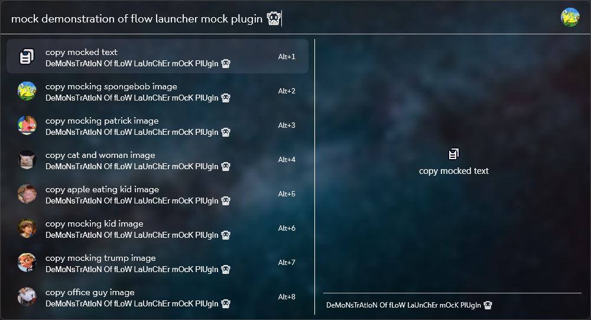

<div align="center">
    <div>
        <a href="https://github.com/Flow-Launcher/Flow.Launcher.PluginsManifest">
            
        </a>
        <a href="https://github.com/tho-myr/Flow.Launcher.Plugin.Mock/issues">
            
        </a>
        <a href="https://github.com/tho-myr/Flow.Launcher.Plugin.Mock/pulls">
            
        </a>
        <a href="https://github.com/tho-myr/Flow.Launcher.Plugin.Mock/commits">
            
        </a>
    </div>
</div>

<br>

<div align="center">
    
  
  <h1>
    Mock 👾
	<br>
	generate mocking case and memes
    <br>
    (⬭ω⬭)
  </h1>
</div>

<br>

> [!NOTE]
>
> Feel free to leave suggestions or report bugs in the [issues](https://github.com/tho-myr/Flow.Launcher.Plugin.Mock/issues) section. 
> Or fork the project and create a pull request with your own changes ^-^

A plugin to generate mocking case and memes with [flow launcher](https://github.com/Flow-Launcher/Flow.Launcher) 🥸

### Installation

1. Install [flow launcher](https://github.com/Flow-Launcher/Flow.Launcher) if you haven't already.
2. Execute the following command in flow launcher to install the plugin.

```cmd
pm install Mock by tho-myr
```

### Usage

```cmd
mock <query_to_mock>
```

#### Query example



#### Output example


### Development

#### Prerequisites

- Install dotnet version <=7.x.x from Microsoft [here](https://dotnet.microsoft.com/en-us/download). 
- Install latest version of [flow launcher](https://github.com/Flow-Launcher/Flow.Launcher). (default installation path is recommended for faster testing)

#### Build project

Run the following command in the root folder of the repository/project.

Exit [flow launcher](https://github.com/Flow-Launcher/Flow.Launcher), build with `dotnet build` 
and then restart [flow launcher](https://github.com/Flow-Launcher/Flow.Launcher)

```cmd
dotnet build
```

> [!WARNING]
> The output folder during `dotnet build` is set to the default flow launcher installation path.
> 
> ```$(UserProfile)\AppData\Roaming\FlowLauncher\Plugins\Http Status Codes-DEBUG\```
>
> To build the project in the project directory remove or comment out the following line from [Flow.Launcher.Plugin.Mock.csproj](Flow.Launcher.Plugin.Mock/Flow.Launcher.Plugin.Mock.csproj).
>
> ```<OutputPath>$(UserProfile)\AppData\Roaming\FlowLauncher\Plugins\Http Status Codes-DEBUG\</OutputPath>```
>
> If commented out you have to manually paste the build files from the folder `/Flow.Launcher.Plugin.Mock/bin/Debug` to the plugin folder of your [flow launcher](https://github.com/Flow-Launcher/Flow.Launcher) installation.

### Release plugin

1. Update [CHANGELOG.md](CHANGELOG.md) for new release.
2. Update version in [plugin.json](Flow.Launcher.Plugin.Mock/plugin.json)
3. Merge changes into `master` branch
4. Create the tag `v1.x.x` on the merge commit on the `master` branch and the release will be built by github actions
5. Follow the steps [here](https://github.com/Flow-Launcher/Flow.Launcher.PluginsManifest?tab=readme-ov-file#how-to-submit-your-plugin) to submit plugin 

### Inspiration

Love to the developers of the [Shortcuts Plugin](https://github.com/mantasjasikenas/flow-launcher-shortcuts-plugin). 
I took a lot of inspiration from their plugin and would like to thank them here <3

Thanks for using my plugin or reading through this long-ass readme. love yall (づ ◕‿◕ )づ